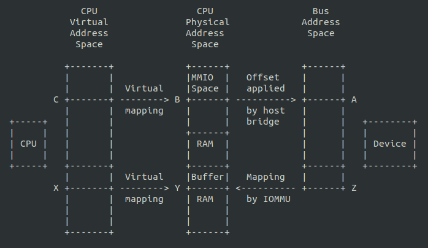

# DMA + scatterlist

- 虚拟地址一般用'void *'表示（kmalloc或者vmalloc等接口得到）

- 虚拟地址系统(TLB, page tables etc.)会将虚拟地址转化成物理地址（phys_addr_t或者resource_size_t）

- 通过/proc/iomem可以查看系统的物理地址资源，物理地址资源不能直接用在驱动中，需要ioremap来产生一个虚拟地址使用。

- io设备会用一个第三方的地址‘bus address’，如果一个设备注册了一个iommu的地址或者在用dma的读写系统内存的时候，设备用的地址就是'bus address'，在一些系统里物理地址和总线地址是相同的。通常是不同的。iommu可以在物理地址和总线地址之间map。

- 从设备角度来看dma用的是总线地址。

  

- 设备只能使用物理地址，不能使用虚拟地址。

- 简单系统中，设备可以直接用物理地址做dma操作，但是在一些复杂的情况下（IOMMU硬件开启），iommu会进行地址转换，将Z地址转换到Y地址，以下是需要DMA API的原因之一：driver可以用一个虚拟地址给dma_map_single()，这会建立一个iommu的map，然后得到DMA的地址Z，然后driver会让设备进行对Z的DMA，iommu会将其map到地址Y上。

- #include <linux/dma-mapping.h>需要包括。其中dma_addr_t包括了有效的dma地址。

- 使用dma前需要设置dma mask（dma_set_mask_add_coherent(dev, DMA_BIT_MASK(32))），表示dma能映射的地址空间范围。

- consistent DMA（一致性dma映射），设备和cpu可以并行访问数据，但是不能保证访问的顺序。

- 使用一致性dma映射，

  ```c
  dma_addr_t dma_handle;
  cpu_addr = dma_alloc_coherent(dev, size, &dma_handle, gfp);
  ```

  一般使用大空间dma是会用这个接口，这个接口映射的内存类似__get_free_pages()，如果需要小于一页的dma映射内存，一般会用dma_poll。

- dma_pool类似kmem_cache，但是是用dma_alloc_coherent()来获得的内存，而不是__get_free_pages()

  ```c
  struct dma_pool *pool;
  pool = dma_pool_create(name, dev, size, align, boundary);
  ```

- 从dma pool中获取memory，释放memory，销毁dma pool

  ```c
  cpu_addr = dma_pool_alloc(pool, flags, &dma_handle);
  dma_pool_free(pool, cpu_addr, dma_handle);
  dma_pool_destroy(pool);
  ```

  

- DMA方向，用于streaming DMA

  DMA_BIDIRECTIONAL: either direction

  DMA_TO_DEVICE: from memory to main memory

  DMA_FROM_DEVICE: from device to main memory

  DMA_NONE: used for debugging this will help catch cases where your direction tracking logic has failed to set things up properly

- streaming DMA

  to map a single region, should call dma_unmap_single() when the DMA activity is finished from the interrupt which told you that the DMA transfer is done.

  ```c
  struct device *dev = &my_dev->dev;
  dma_addr_t dma_handle;
  void *addr = buffer->ptr;
  size_t size = buffer->len;
  dma_handle = dma_map_single(dev, addr, size, direction);
  if(dma_mapping_error(dma_handle)) {
      goto map_error_handling;    
  }
  dma_unmap_single(dev, dma_handle, size, direction);
  ```

- 如果想要map一个高端内存的dma那么需要用到dma_map_page和dma_unmap_page

  ```c
  struct device *dev = &my_dev->dev;          
  dma_addr_t dma_handle;          
  struct page *page = buffer->page;                                       
  unsigned long offset = buffer->offset;   
  size_t size = buffer->len;                                    
  dma_handle = dma_map_page(dev, page, offset, size, direction);     
      if (dma_mapping_error(dma_handle)) {                           
        /*               
         * reduce current DMA mapping usage,    
         * delay and try again later or         
         * reset driver.                                    
         */      
          goto map_error_handling;       
      }              
  ```

  offset: byte offset within the given page.

  同样，当传输完成后需要unmap。

- 通过scatterlists 可以map 一个通过多个区域联合的区域

  ```c
  int i, count = dma_map_sg(dev, sglist, nents, direction);    
  struct scatterlist *sg;                   
  for_each_sg(sglist, sg, count, i) {   
      hw_address[i] = sg_dma_address(sg);   
      hw_len[i] = sg_dma_len(sg);    
      }                                                                
  ```

  

- scatterlist

  多个scatterlist组成一个数组，以表示在物理上不连续的多个虚拟地址空间
  
  ```c
  struct scatterlist {
  #ifdef CONFIG_DEBUG_SG         
      unsigned long   sg_magic;
  #endif                                                                   unsigned long   page_link; //多个scatterlist链接用                     unsigned int    offset;   //数据偏移                                   unsigned int    length;  //数据长度                                   dma_addr_t  dma_address; //物理地址                                #ifdef CONFIG_NEED_SG_DMA_LENGTH          
      unsigned int    dma_length;
  #endif              
      
  };
  sg_init_one(&sg, cpu_addr, size);
    sg_init_table(sg, 1); //初始化一个scatterlist结构体，清零。
      //清0sg空间，//标记end（设置page_link(最后一个page_link |= 2 &= ~0x1)）
    sg_set_buf(sg, buf, buflen);//buf 虚拟地址，buflen 数据长度
       //virt_to_page：找到虚拟地址对应的物理页，offset_in_page：虚拟地址在页中的偏移
       sg_set_page(sg, virt_to_page(buf), buflen, offset_in_page(buf))
      
          sg_assign_page(sg, page)//设置page_link的[63:2]=page,[1:0]=表示page_link状态
          sg_offset = offset;
        sg_length = len;
  ```
  
  