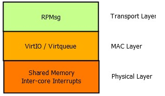
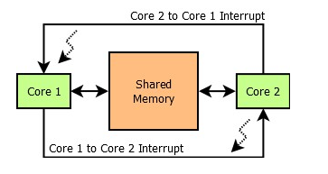
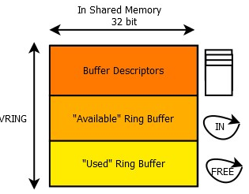
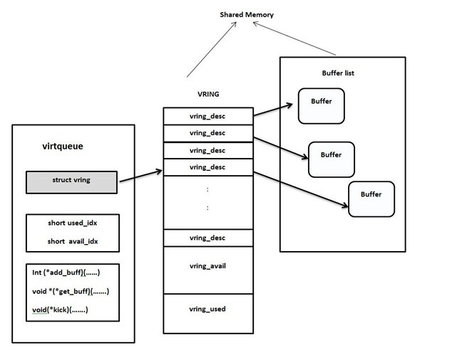
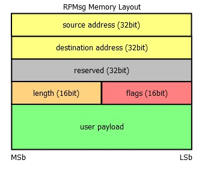
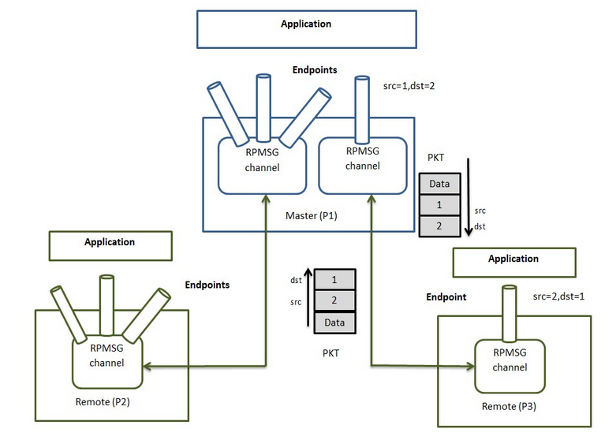
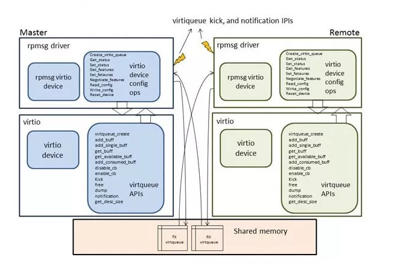
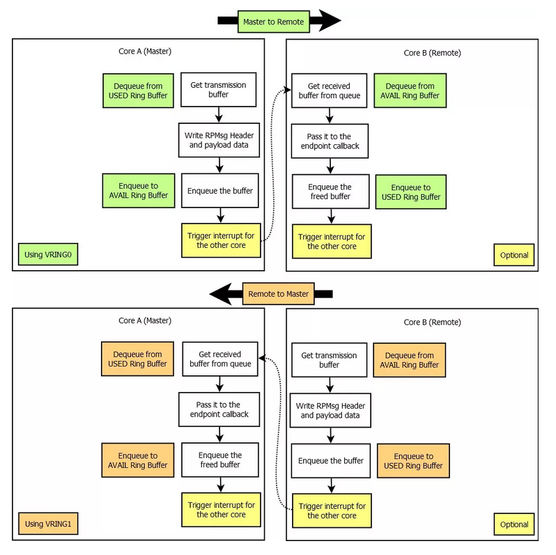

# rpmsg+virtio

## Protocol Layers

The whole communication implementation can be separated in three  different ISO/OSI layers Transport, Media Access Control and Physical  layer. Each of them can be implemented separately



## Physical Layer

### two basic hardware components:

- shared memory
- inter-core interrupts



## Media Access Layer - VirtIO
This is achieved by a technique called single-writer single-reader circular buffering.


可以理解为每一个virtio_device会在probe的时候创建virtqueue，这个virtqueue是从vring中获取的



## Transport Layer - RPMsg

Each RPMsg message is contained in a buffer, which is present in the  shared memory. This buffer is pointed to by the address field of a  buffer descriptor from vring’s buffer descriptor pool. 



### RPMsg Channels

**Every remote core in RPMsg component is represented by RPMsg device** that provides a communication channel between master and remote, hence RPMsg devices are also known as channels. RPMsg channel is identified by the **textual name** and local **source** and **destination address**. The RPMsg framework keeps track of channels using their names.

### RPMsg Endpoints

RPMsg endpoints provide logical connections on top of RPMsg channel. Every RPMsg endpoint has a unique src address and associated call  back function. When an application creates an endpoint with the local  address, all the further inbound messages with the destination address  equal to local address of endpoint are routed to that callback function. Every channel has a default endpoint which enables applications to  communicate without even creating new endpoints.



## RPMsg Frame

The rpmsg component uses virtio-provided interfaces to transmit and receive data with its counterpart. As a transport abstraction, virtio provides two key interfaces to upper level users:

kick（让本地产生一个信号，触发对端的中断）

notify（让对端产生一个信号，出发本地中断）





## virtio_rpmsg_bus的kernel 实现

主要数据结构

```c
/**               
 * @vrp: the remote processor this channel belongs to
 */
struct virtio_rpmsg_channel {                                                   
    struct rpmsg_device rpdev;                                                  
                                                                                
    struct virtproc_info *vrp;                                                  
};
/**       
 * struct virtproc_info - virtual remote processor state              
 * @vdev:   the virtio device                                             
 * @rvq:    rx virtqueue                                                 
 * @svq:    tx virtqueue                               
 * @rbufs:  kernel address of rx buffers        
 * @sbufs:  kernel address of tx buffers                 
 * @num_bufs:   total number of buffers for rx and tx       
 * @buf_size:   size of one rx or tx buffer                  
 * @last_sbuf:  index of last tx buffer used           
 * @bufs_dma:   dma base addr of the buffers           
 * @tx_lock:    protects svq, sbufs and sleepers, to allow concurrent senders.  
 *      sending a message might require waking up a dozing remote      
 *      processor, which involves sleeping, hence the mutex.          
 * @endpoints:  idr of local endpoints, allows fast retrieval           
 * @endpoints_lock: lock of the endpoints set                         
 * @sendq:  wait queue of sending contexts waiting for a tx buffer
 * @sleepers:   number of senders that are waiting for a tx buffer     
 * @ns_ept: the bus's name service endpoint          
 *            
 * This structure stores the rpmsg state of a given virtio remote processor     
 * device (there might be several virtio proc devices for each physical   
 * remote processor).      
 */                                                                             
struct virtproc_info { 
    struct virtio_device *vdev;                     
    struct virtqueue *rvq, *svq;               
    void *rbufs, *sbufs;                          
    unsigned int num_bufs;                    
    unsigned int buf_size;               
    int last_sbuf;                              
    dma_addr_t bufs_dma;                  
    struct mutex tx_lock;                                  
    struct idr endpoints;                                  
    struct mutex endpoints_lock;                      
    wait_queue_head_t sendq;                                      
    atomic_t sleepers;                                            
    struct rpmsg_endpoint *ns_ept;                       
};
/**                                                 
 * struct rpmsg_endpoint - binds a local rpmsg address to its user     
 * @rpdev: rpmsg channel device                     
 * @refcount: when this drops to zero, the ept is deallocated     
 * @cb: rx callback handler                  
 * @cb_lock: must be taken before accessing/changing @cb       
 * @addr: local rpmsg address        
 * @priv: private data for the driver's use       
 *                                
 * In essence, an rpmsg endpoint represents a listener on the rpmsg bus, as     
 * it binds an rpmsg address with an rx callback handler.        
 *                     
 * Simple rpmsg drivers shouldn't use this struct directly, because
 * things just work: every rpmsg driver provides an rx callback upon    
 * registering to the bus, and that callback is then bound to its rpmsg   
 * address when the driver is probed. When relevant inbound messages arrive     
 * (i.e. messages which their dst address equals to the src address of    
 * the rpmsg channel), the driver's handler is invoked to process it.   
 *          
 * More complicated drivers though, that do need to allocate additional rpmsg   
 * addresses, and bind them to different rx callbacks, must explicitly   
 * create additional endpoints by themselves (see rpmsg_create_ept()).   
 */                                                                             
struct rpmsg_endpoint {                     
    struct rpmsg_device *rpdev;                   
    struct kref refcount;               
    rpmsg_rx_cb_t cb;                       
    struct mutex cb_lock;          
    u32 addr;                         
    void *priv;                            
    const struct rpmsg_endpoint_ops *ops;                        
};   
/**                                                                             
 * rpmsg_device - device that belong to the rpmsg bus            
 * @dev: the device struct           
 * @id: device id (used to match between rpmsg drivers and devices)   
 * @driver_override: driver name to force a match       
 * @src: local address 
 * @dst: destination address             
 * @ept: the rpmsg endpoint of this channel      
 * @announce: if set, rpmsg will announce the creation/removal of this channel  
 */      
struct rpmsg_device {        
    struct device dev;                     
    struct rpmsg_device_id id;      
    char *driver_override;         
    u32 src;        
    u32 dst;                                
    struct rpmsg_endpoint *ept;                
    bool announce;                    
    const struct rpmsg_device_ops *ops;                                   
}; 

```

驱动的匹配和注册

```c
register_virtio_driver(&virtio_ipc_driver);//向virtrio bus中注册virtio_rpmsg_bus的driver;
virtio_dev_match();//比较driver的id_table（遍历所有id）和device的id（device id，vendor id）（VIRTIO_ID_RPMSG，VIRTIO_DEV_ANY_ID）;
virtio_dev_probe();//virtio_device匹配后调用，其中会用device中注册的config-add_status设置自定义设备的status=VIRTIO_CONFIG_S_DRIVER; 获取定义的virtio_device的feature（driver中可能会需要）;检查driver支持的feature; 设置status=VIRTIO_CONFIG_S_FEATURES_OK; 调用virtio_rpmsg_bus中的rpmsg_probe;设置virtio_device中的config_enable=true;
rpmsg_probe();//创建virtqueue_info vrp，分配空间;初始化vrp的local endpoints的idr，用于快速取回;初始化互斥锁和等待队列;调用virtio_device中注册的find_vqs,virtio_find_vqs为每个remote报上来的中断添加一个处理的virtqueue，request_irq;为rx，tx开辟dma地址空间，如果virtio_device支持VIRTIO_RPMSG_F_NS feature，会创建一个ns_ept(其回调中可以创建channel);通过配置remote device的寄存器使其产生中断（notify），virtio_device我们（host）已经准备好
virtio_find_vqs();//创建底层的vring_virtqueue以及其中的vring,并注册终端和回调
```
系统架构


用户空间的使用

```
/** user-space application source code
  * example channel: rpmsg-openamp-demo-channel [src=0x2 ----&gt; dst=0x1]
  */

msg_data_t data_buf;

struct rpmsg_endpoint_info ept_info = {"rpmsg-openamp-demo-channel", 0x2, 0x1};
int fd = open("/dev/rpmsg_ctrl0", O_RDWR);

/* create endpoint interface */
ioctl(fd, RPMSG_CREATE_EPT_IOCTL, &ept_info);  // /dev/rpmsg0 is created 

/* create endpoint */
int fd_ept = open("/dev/rpmsg0", O_RDWR); // backend creates endpoint

/* receive data from remote device */
read(fd_ept, &data_buf, sizeof(data_buf));

/* send data to remote device */ 
write(fd_ept, &data_buf, sizeof(data_buf));

/* destroy endpoint */
ioctl(fd_ept, RPMSG_DESTROY_EPT_IOCTL);

close(fd_ept);
close(fd);
```

rpmsg的发送

用户调用write------>rpmsg_eptdev_write_iter------>rpmsg_send或者rpmsg_trysend------>virtio_rpmsg_send------>rpmsg_send_offchannel_raw（rpmsg_hdr msg; 拷贝data; ）------>virtqueue_add(判断是否是packed; 将该数据添加到available vring，让对端知道)------>virtqueue_kick(通知对端，触发对端中断)

rpmsg的接收

中断触发后，之前注册（find_vqs）在virtio层的中断函数（vring_interrupt）开始执行，调用virtqueue回调(find_vqs)中注册回调（virtqueue也是在(find_vqs)中注册的）rpmsg_recv_done------>virtqueue_get_buf(从virtqueue中的数据(virtqueue_add的)取出来)------>rpmsg_recv_single调用rpmsg中的ept->cb（rpmsg_ept_cb, 将数据存入队列skb_queue_tail）------>唤醒等待数据锁(eptdev->readq)等待队列------>继续执行rpmsg_eptdev_read_iter拷贝数据到用户空间------>返回用户空间


rpmsg_channel的创建
open rpmsg_chrv设备节点时会创建一个ept(通过virtio_rpmsg_ops.create_ept)ept中注册了virtio_endpoint_ops


