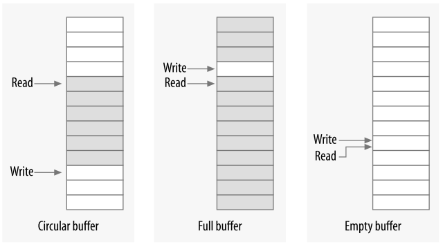

# Chapter 5: Concurrency and Race Conditions
- Concurrency-related bugs are some of the easiest to create and some of the hardest to find. Even expert Linux kernel programmers end up creating concurrency related bugs on occasion.

- Kernel code is preemptible. your driver’s code can lose the processor at any time, and the process that replaces it could also be running in your driver. 
- Race conditions come about as a result of shared access to resources. 
- When kernel code creates an object that will be shared with any other part of the kernel, that object must continue to exist (and function properly) until it is known that no outside references to it exist.
- Note the check on the return value of down_interruptible; if it returns nonzero, the operation was interrupted. The usual thing to do in this situation is to return -ERESTARTSYS. Upon seeing this return code, the higher layers of the kernel will either restart the call from the beginning or return the error to the user. If you return -ERESTARTSYS, you must first undo any user-visible changes that might have been made, so that the right thing happens when the system call is retried. If you cannot undo things in this manner, you should return -EINTR instead.
- Completions are a lightweight mechanism with one task: allowing one thread to tell another that the job is done. To use completions, your code must include <linux/completion.h>. 
- 
```c
void wait_for_completion(struct completion *c);
```
Note that this function performs an uninterruptible wait. If your code calls wait_for_completion and nobody ever completes the task, the result will be an unkillable process.
- Unlike semaphores, spinlocks may be used in code that can not sleep, such as interrupt handlers.
- If a nonpreemptive uniprocessor system ever went into a spin on a lock, it would spin forever; no other thread would ever be able to obtain the CPU to release the lock. **其实linux在设计可抢占式系统的自旋锁时只是把自旋锁设计为"只是禁止内核抢占",而没有自旋** 
1. 在单cpu，不可抢占内核中，自旋锁为空操作。 
2. 在单cpu，可抢占内核中，自旋锁实现为“禁止内核抢占”，并不实现“自旋”。(注意) 
3. 在多cpu，可抢占内核中，自旋锁实现为“禁止内核抢占” + “自旋”。 
- requires disabling interrupts (on the local CPU only) while the spinlock is held. 
- Locking should really be laid out at the beginning; it can be a hard thing to retrofit in afterward. Time taken at the outset usually is paid back generously at debugging time.
- Neither semaphores nor spin locks allow a lock holder to acquire the lock a second time.
- A data structure that can often be useful for lockless producer/consumer tasks is the circular buffer. Circular buffers show up reasonably often in device drivers. Networking adaptors, in particular, often use circular buffers to exchange data (packets) with the processor.


- Read-Copy-Update
  - RCU places a number of constraints on the sort of data structure that it can protect. It is optimized for situations where reads are common and writes are rare.
  - The resources being protected should be accessed via pointers, and all references to those resources must be held only by atomic code. When the data structure needs to be changed, the writing thread makes a copy, changes the copy, then aims the relevant pointer at the new version—thus, the name of the algorithm. When the kernel is sure that no references to the old version remain, it can be freed.