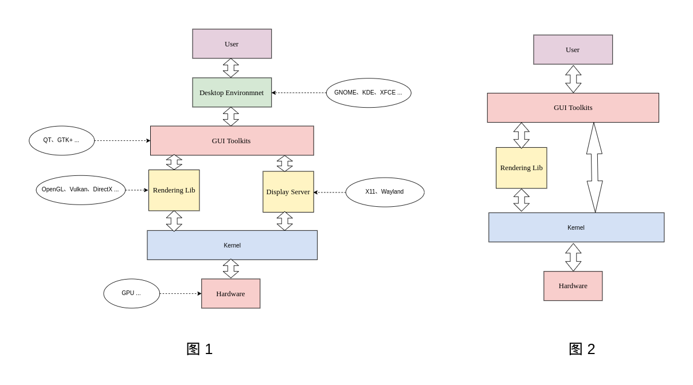
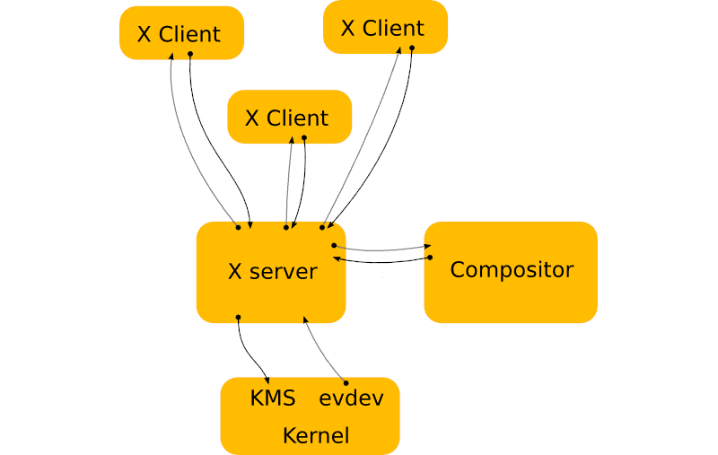
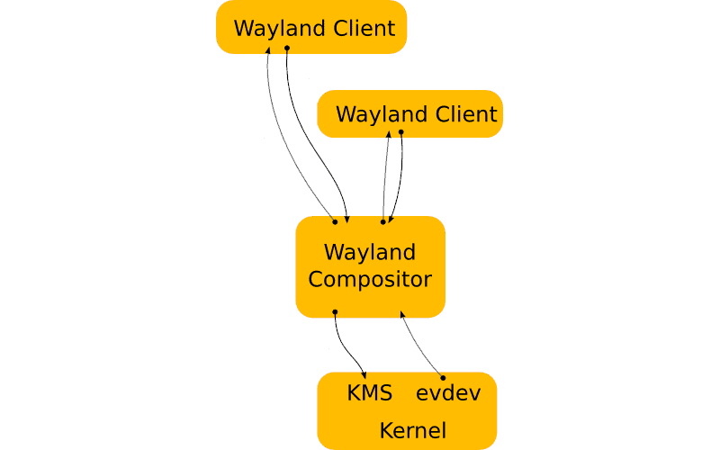
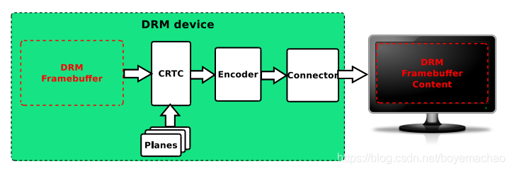
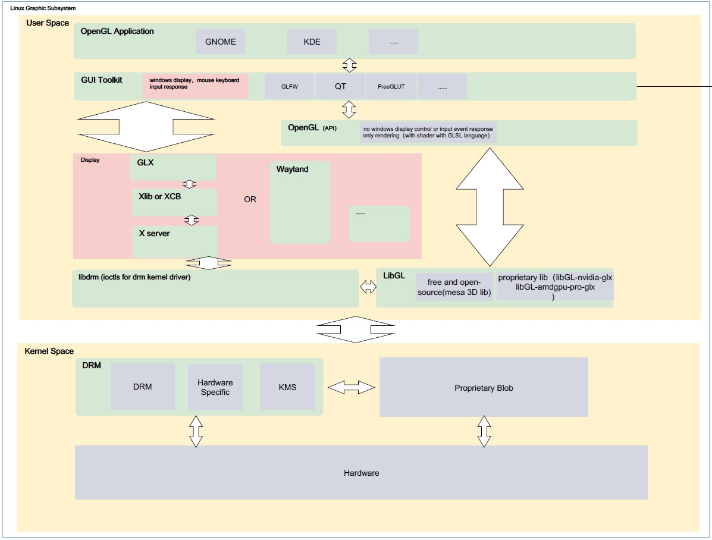

# Linux Graphics

## 一、概述

主流的Linux的图形子系统主要有下图几个部分构成。

图 1：

1. 不带桌面环境的Linux版本。
2. 一般用于资源敏感的场景。
3. 一般用于功能较单一的嵌入式产品中。

图 2：

1. 主流的带桌面环境的Linux发行版。
2. 一般用于对图形要求较高场景，功能较全。
3. 一般用于具有较复杂图形交互的场景的PC机中。

## 二、用户空间

### 2.1 Desktop Enviroment

主要通过GUI用户交互供用户使用，可以通过简单的图形化的操作完成使用的操作。桌面环境为操作系统提供了一个较完整的图形操作界面, 和提供了一定范围和用途的实用工具和应用程序。一般用于通用型PC平台。Linux发行版中包括很多不同的桌面环境，主流的有：

1. KDE
2. GNOME
3. Unity
4. Mate
5. Cinnamon
6. XFCE
7. LXDE
8. ......

桌面环境都是由基于GUI Toolkit实现。主流的GUI Toolkit主要有GTK+、QT。

### 2.2 Window Manager

窗口管理器和桌面环境是用户在 X Window 系统里的主要界面. 窗口管理器只是个程序, 它控制窗口的外表,位置和提供用户去操作这些窗口程序的方法. 桌面环境为操作系统提供了一个较完整的图形操作界面, 和提供了一定范围和用途的实用工具和应用程序。

窗口管理器一般在桌面环境中负责桌面环境的窗口管理。一般各个桌面都有自己的默认窗口管理器。例如XFCE4的Xfwm、LXDE的Openbox等。

还有一些窗口管理器可以独立于桌面环境，相当于一个占用资源低、简洁的桌面环境。例如：
1. Awesome
2. dwm
3. twm
4. ......

窗口管理器一般是一个X client或者Wayland client。

### 2.3 GUI Toolkit

主流GUI Toolkit为GTK+和QT

#### 2.3.1 GTK+

- GTK+ 是一种图形用户界面（GUI）工具包。也就是说，它是一个库（或者，实际上是若干个密切相关的库的集合），它支持创建基于 GUI 的应用程序。可以把 GTK+ 想像成一个工具包，从这个工具包中可以找到用来创建 GUI 的许多已经准备好的构造块。同时，GIMP 无疑仍然是使用 GTK+ 的最著名的程序之一，不过它已经不是惟一的使用 GTK+ 的程序了。已经为 GTK+ 编写了成百上千的应用程序。

- 至少有两个主要的桌面环境（Xfce 和 GNOME）用 GTK+ 为用户提供完整的工作环境。

- GTK+虽然是用C语言写的，但是您可以使用你熟悉的语言来使用GTK+，因为GTK+已经被绑定到几乎所有流行的语言上，如：C++,PHP, Guile,Perl, Python, TOM, Ada95, Objective C, Free Pascal, and Eiffel。

- GTK特点

  现代化、更新快：GTK+ 是采用软件开发中的最新技术开发的，只要发现缺陷（BUG）（肯定有缺陷，因为没有任何软件是完美的），开发人员就会尽力在下一版本中修补缺陷。使用现代的软件意味着，您不会陷在过时的工作中，而跟不上时代的发展。
  国际化、可访问性：在创建要让所有人使用的软件的时候，请记住三个关键字：国际化、本地化和可访问性（通常分别缩写为 i18n、l10n 和 a11y）。
  简单易用：这一点应当很明显，但是它实际上含义丰富。工具包对用户应当容易，这样才有可能创建简单的、直觉的和乐于使用的界面，哪怕针对的是新手。创建人机交互的正确模型不是一项简单的任务，GTK+ 正是长时间工作的结果，而且是众多的甚至困难的决策的结果。
  设计灵活、可扩展：编写 GTK+ 的方式允许在不扭曲基本设计的情况下，让维护人员添加新功能、让用户利用新功能。工具包也是可扩展的，这意味着可以向其中添加自己的块，并用使用内置块一样的方式使用它们。例如，可以编写自己的控制元素，比如说用于显示应用程序处理的科学数据，并让它正确地遵照用户选择的显示风格，就像 GTK+ 自身的控件那样。
  自由、开放：自由软件 意味着每个人不仅可以自由地获得和使用这个工具包，还可以在满足某些条件的情况下修改并重新发布它。自由开放源码许可 意味着这些条件不是严格限制的，可以得到的自由程度是显著的。
  可移植：GTK+ 是可移植的。这意味着用户可以在许多平台和系统上运行它。另一方面，开发人员可以把软件提供给众多用户，却只要编写一次程序，还可以使用许多不同的编程和开发平台、工具和编程语言。所有这些都可以理解为更多的潜在用户，您可以利用更好地满足需求的更广泛的技能和工具。

#### 2.3.2 QT

- Qt（官方发音 [kju:t]，音同 cute）是一个跨平台的 C++ 开发库，主要用来开发图形用户界面（Graphical User Interface，GUI）程序，当然也可以开发不带界面的命令行（Command User Interface，CUI）程序。
- Qt 虽然经常被当做一个 GUI 库，用来开发图形界面应用程序，但这并不是 Qt 的全部；Qt 除了可以绘制漂亮的界面（包括控件、布局、交互），还包含很多其它功能，比如多线程、访问数据库、图像处理、音频视频处理、网络通信、文件操作等，这些 Qt 都已经内置了。
- Qt 被用来开发 Linux 桌面环境 KDE。

### 2.4 Display Server

- Linux不是一种基于图形界面环境的操作系统，它的图形环境是完全可以卸载。在内核眼里，图形环境只不过是一个普通的应用程序，和其他的服务器程序没有什么不同。
- 显示服务器是一个程序，它负责协调其客户端与操作系统的其他部分之间，以及硬件和操作系统之间的输入和输出。基本上，多亏了显示服务器，你才能以图形化的方式使用你的计算机（GUI）。如果没有显示服务器，你只能局限于命令行界面（TTY）。显示服务器提供了一个图形环境的框架，使你可以使用鼠标和键盘与应用程序进行交互。显示服务器通过显示服务器协议（如 X11、Wayland）与客户端进行通信。显示服务器是图形用户界面特别是窗口系统中的一个关键组件。不要把显示服务器和桌面环境混淆。桌面环境的下层使用的是显示服务器。
- Linux显示系统是Client/Server架构，App是client，系统中有提供Display Server的进程，两者一起构成了Linux的图形显示。

#### 2.4.1 显示服务器协议简介

- X11
  X是一个协议并不是具体的实现，类似HTTP，WSGI一样都是协议，X11就是X协议的第11版。X协议中X应用程序负责通过X协议告诉服务端需要在服务端显示什么图形，然后服务端收到消息后就会通过服务端上的Xserver的实现来显示客户端程序想要的图形。
  
  
  
  

  [Xorg]: https://www.x.org/wiki/

  实现了这个协议作出了相应的库，软件，插件，xorg driver等。当然也有其他的公司实现了X协议，但市面上主流的Linux发行版X协议的实现都是使用的Xorg。
  
- Wayland

  Wayland是一个X的替代，功能与X一样也是提供了一个协议来处理各个App的显示。但是协议和实现方式与Xorg有所不同。他的架构更加的简单，效率更高，对3D的渲染更加友好，但是现在的兼容性还没X那么好。部分硬件场上还没有相应的官方驱动。
  
  

### 2.5 Libdrm

和显卡驱动强相关，主要是封装了驱动的IOCTL操作。

## 三、内核空间

### 3.1 DRM

Direct Rending Mangement，DRM是Linux目前主流的图形显示框架，

#### 3.1.2 GEM

主要用来对framebuffer底层的内存进行管理（分配、回收、共享等）。

#### 3.1.1 KMS

- Framebuffer

  用来存放显示内容的buffer。

- CRTC

  对显示buffer进行扫描，并产生时序信号的硬件模块，通常指Display Controller。

- Encoder

  负责将CRTC输出的timing时序转换成外部设备所需要的信号的模块，如HDMI转换器或DSI Controller。

- Connector

  连接物理显示设备的连接器，如HDMI、DisplayPort、DSI总线，通常和Encoder驱动绑定在一起。

  

## 四、总结
总结如上部分，得出以下框架：

