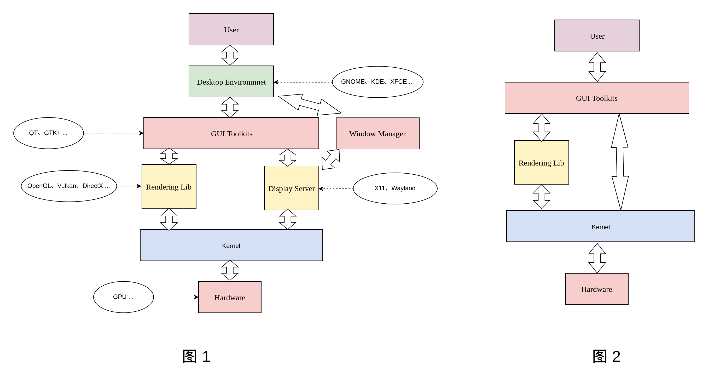

# Linux Graphics

## 一、概述

主流的Linux的图形子系统主要有下图几个部分构成。



图 1：

1. 主流的带桌面环境的Linux发行版。
2. 一般用于对图形要求较高场景，功能较全。
3. 一般用于具有较复杂图形交互的场景的PC机中。

图 2：

1. 不带桌面环境的Linux版本。
2. 一般用于资源敏感的场景。
3. 一般用于功能较单一的嵌入式产品中。


## 二、用户空间

### 2.1 Desktop Enviroment

主要通过GUI用户交互供用户使用，可以通过简单的图形化的操作完成使用的操作。桌面环境为操作系统提供了一个较完整的图形操作界面, 和提供了一定范围和用途的实用工具和应用程序。一般用于通用型PC平台。Linux发行版中包括很多不同的桌面环境，主流的有：

1. KDE
2. GNOME
3. Unity
4. Mate
5. Cinnamon
6. XFCE
7. LXDE
8. ......

桌面环境都是由基于GUI Toolkit实现。主流的GUI Toolkit主要有GTK+、QT。

### 2.2 Window Manager

窗口管理器和桌面环境是用户在 X Window 系统里的主要界面. 窗口管理器只是个程序, 它控制窗口的外表,位置和提供用户去操作这些窗口程序的方法. 桌面环境为操作系统提供了一个较完整的图形操作界面, 和提供了一定范围和用途的实用工具和应用程序。

窗口管理器一般在桌面环境中负责桌面环境的窗口管理。一般各个桌面都有自己的默认窗口管理器。例如XFCE4的Xfwm、LXDE的Openbox等。

还有一些窗口管理器可以独立于桌面环境，相当于一个占用资源低、简洁的桌面环境。例如：
1. Awesome
2. dwm
3. twm
4. ......

窗口管理器一般是一个X client或者Wayland client。

### 2.3 GUI Toolkit

主流GUI Toolkit为GTK+和QT

#### 2.3.1 GTK+

- GTK+ 是一种图形用户界面（GUI）工具包。也就是说，它是一个库（或者，实际上是若干个密切相关的库的集合），它支持创建基于 GUI 的应用程序。可以把 GTK+ 想像成一个工具包，从这个工具包中可以找到用来创建 GUI 的许多已经准备好的构造块。同时，GIMP 无疑仍然是使用 GTK+ 的最著名的程序之一，不过它已经不是惟一的使用 GTK+ 的程序了。已经为 GTK+ 编写了成百上千的应用程序。

- 至少有两个主要的桌面环境（Xfce 和 GNOME）用 GTK+ 为用户提供完整的工作环境。

- GTK+虽然是用C语言写的，但是您可以使用你熟悉的语言来使用GTK+，因为GTK+已经被绑定到几乎所有流行的语言上，如：C++,PHP, Guile,Perl, Python, TOM, Ada95, Objective C, Free Pascal, and Eiffel。

- GTK特点

  现代化、更新快：GTK+ 是采用软件开发中的最新技术开发的，只要发现缺陷（BUG）（肯定有缺陷，因为没有任何软件是完美的），开发人员就会尽力在下一版本中修补缺陷。使用现代的软件意味着，您不会陷在过时的工作中，而跟不上时代的发展。
  国际化、可访问性：在创建要让所有人使用的软件的时候，请记住三个关键字：国际化、本地化和可访问性（通常分别缩写为 i18n、l10n 和 a11y）。
  简单易用：这一点应当很明显，但是它实际上含义丰富。工具包对用户应当容易，这样才有可能创建简单的、直觉的和乐于使用的界面，哪怕针对的是新手。创建人机交互的正确模型不是一项简单的任务，GTK+ 正是长时间工作的结果，而且是众多的甚至困难的决策的结果。
  设计灵活、可扩展：编写 GTK+ 的方式允许在不扭曲基本设计的情况下，让维护人员添加新功能、让用户利用新功能。工具包也是可扩展的，这意味着可以向其中添加自己的块，并用使用内置块一样的方式使用它们。例如，可以编写自己的控制元素，比如说用于显示应用程序处理的科学数据，并让它正确地遵照用户选择的显示风格，就像 GTK+ 自身的控件那样。
  自由、开放：自由软件 意味着每个人不仅可以自由地获得和使用这个工具包，还可以在满足某些条件的情况下修改并重新发布它。自由开放源码许可 意味着这些条件不是严格限制的，可以得到的自由程度是显著的。
  可移植：GTK+ 是可移植的。这意味着用户可以在许多平台和系统上运行它。另一方面，开发人员可以把软件提供给众多用户，却只要编写一次程序，还可以使用许多不同的编程和开发平台、工具和编程语言。所有这些都可以理解为更多的潜在用户，您可以利用更好地满足需求的更广泛的技能和工具。

#### 2.3.2 QT

- Qt（官方发音 [kju:t]，音同 cute）是一个跨平台的 C++ 开发库，主要用来开发图形用户界面（Graphical User Interface，GUI）程序，当然也可以开发不带界面的命令行（Command User Interface，CUI）程序。
- Qt 虽然经常被当做一个 GUI 库，用来开发图形界面应用程序，但这并不是 Qt 的全部；Qt 除了可以绘制漂亮的界面（包括控件、布局、交互），还包含很多其它功能，比如多线程、访问数据库、图像处理、音频视频处理、网络通信、文件操作等，这些 Qt 都已经内置了。
- Qt 被用来开发 Linux 桌面环境 KDE。

### 2.4 Display Server

- Linux不是一种基于图形界面环境的操作系统，它的图形环境是完全可以卸载。在内核眼里，图形环境只不过是一个普通的应用程序，和其他的服务器程序没有什么不同。
- 显示服务器是一个程序，它负责协调其客户端与操作系统的其他部分之间，以及硬件和操作系统之间的输入和输出。基本上，多亏了显示服务器，你才能以图形化的方式使用你的计算机（GUI）。如果没有显示服务器，你只能局限于命令行界面（TTY）。显示服务器提供了一个图形环境的框架，使你可以使用鼠标和键盘与应用程序进行交互。显示服务器通过显示服务器协议（如 X11、Wayland）与客户端进行通信。显示服务器是图形用户界面特别是窗口系统中的一个关键组件。不要把显示服务器和桌面环境混淆。桌面环境的下层使用的是显示服务器。
- Linux显示系统是Client/Server架构，App是client，系统中有提供Display Server的进程，两者一起构成了Linux的图形显示。

#### 2.4.1 显示服务器协议简介

- X11
  X是一个协议并不是具体的实现，类似HTTP，WSGI一样都是协议，X11就是X协议的第11版。X协议中X应用程序负责通过X协议告诉服务端需要在服务端显示什么图形，然后服务端收到消息后就会通过服务端上的Xserver的实现来显示客户端程序想要的图形。
  
  
  
  

  [Xorg]: https://www.x.org/wiki/

  实现了这个协议作出了相应的库，软件，插件，xorg driver等。当然也有其他的公司实现了X协议，但市面上主流的Linux发行版X协议的实现都是使用的Xorg。
  
- Wayland

  [Wayland]: https://wayland.freedesktop.org/
  
  是一个X的替代，功能与X一样也是提供了一个协议来处理各个App的显示。但是协议和实现方式与Xorg有所不同。他的架构更加的简单，效率更高，对3D的渲染更加友好，但是现在的兼容性还没X那么好。部分硬件场上还没有相应的官方驱动。
  
  

### 2.5 Rendering（Computer Graphics）

渲染，主要是计算机从2D或者3D模型通过计算机程序生成图片的过程。模型可以用语言或者数据结构被定义在一个文件中，这个文件主要包括: geometry, viewport, texture, lighting, shading。

很早之前渲染的工作主要交给CPU做，由于2D、3D模型的数据量较大，一般非常占用CPU，后续GPU的诞生更好了适应了对大数据量2D、3D模型的运算。

#### 2.5.1 Rendering Pipline
简单概括为
Buffers------>Vertex Shader------>Primitive Assambly------>Rasterization------>Fragment Shader------>Framebuffer
详细介绍帮助理解如下：
https://zhuanlan.zhihu.com/p/61949898

https://zhuanlan.zhihu.com/p/137780634

#### 2.5.2 实现计算机渲染（Rendering Pipline）
为了实现计算机的渲染，GPU作为图形渲染的硬件，并有以下通用的图形库（API），OpenGL、OpenGLES、 Vulkan、DirectX、Metal。GPU支持其中一种或者几种后可以实现用硬件进行图形渲染的加速。

- [OpenGL](https://www.khronos.org/opengl/)
	
	由khronos.org维护，是用于渲染2D、3D矢量图形的跨语言、跨平台的应用程序编程接口（API）。这个接口由近350个不同的函数调用组成，用来绘制从简单的图形比特到复杂的三维景象。
	以下包可以用来创建并管理 OpenGL 窗口，也可以管理输入，但几乎没有除此以外的其它功能：
	
	- GLFW：跨平台窗口和键盘、鼠标、手柄处理，偏向游戏。
	- freeglut：跨平台窗口和键盘、鼠标处理，API 是 GLUT API 的超集。
	- QT：跨平台C++窗口组件库，提供了许多 OpenGL 辅助对象，抽象掉了桌面版 OpenGL与 OpenGL ES 之间的区别。
	
- [OpenGL ES](https://www.khronos.org/opengles/)

	由khronos.org维护，OpenGL ES (OpenGL for Embedded Systems) 是 OpenGL 三维图形 API 的子集，针对手机、PDA和游戏主机等嵌入式设备而设计。OpenGL ES 是从 OpenGL 裁剪的定制而来的，去除了glBegin/glEnd，四边形（GL_QUADS）、多边形（GL_POLYGONS）等复杂图元等许多非绝对必要的特性。

- [WebGL](https://get.webgl.org/)

	由khronos.org维护，全写（Web Graphics Library）是一种3D绘图协议，这种技术标准允许把JavaScript和OpenGL ES 2.0结合在一起，通过增加OpenGL ES 2.0的一个JavaScript绑定，WebGL可以为HTML5 Carvas提供硬件3D加速渲染。这样Web开发人员就可以借助系统显卡在浏览器里流畅的显示3D场景和模型了。还能创建复杂的导航和数据视觉化。

- [Vulkan](https://www.vulkan.org)

	由khronos.org维护，同 OpenGL® 一样，Vulkan™ 也由 Khronos 集团开发。它是 AMD Mantle 的后续版本，继承了前者强大的低开销架构，使软件开发人员能够全面获取 Radeon™ GPU 与多核 CPU 的性能、效率和功能。相对于 OpenGL，Vulkan™ 大幅降低了 CPU 在提供重要特性、性能和影像质量时的“API 开销”（CPU 在分析游戏的硬件需求时所执行的后台工作），而且可以使用通常通过 OpenGL 无法访问的 GPU 硬件特性。


- DirectX

	DirectX（Direct eXtension，简称DX）是由微软公司创建的多媒体编程接口，是一种应用程序接口（API）。DirectX可以让以windows为平台的游戏或多媒体程序获得更高的执行效率，加强3D图形和声音效果，并提供设计人员一个共同的硬件驱动标准，让游戏开发者不必为每一品牌的硬件来写不同的驱动程序，也降低用户安装及设置硬件的复杂度。DirectX已被广泛使用于Microsoft Windows、Microsoft XBOX、Microsoft XBOX 360和Microsoft XBOX ONE电子游戏开发。
	
- [Metal](https://developer.apple.com/metal/)

	Apple为游戏开发者推出了新的平台技术 Metal，该技术能够为 3D 图像提高 10 倍的渲染性能，并支持大家熟悉的游戏引擎及公司。Metal 是一种低层次的渲染应用程序编程接口，提供了软件所需的最低层，保证软件可以运行在不同的图形芯片上。Metal 提升了 A7 与 A8 处理器效能，让其性能完全发挥。

**总结：**

- OpenGL ES是OpenGL的子集。
- OpenGL、OpenGL ES、WebGL、Vulkan都是由khronos.org维护的开源跨平台通用图形库。
- khronos.org会主推Vulkan，但是现在Vulkan的使用者还不多，更负责，Vulkan更能发挥出多核的能力。
- DirectX由微软开发，闭源主要用在Windows上。
- Metal由苹果开发，闭源主要用在苹果设备上。

#### 2.5.3 OpenGL在Linux中使用简介

OpenGL是一个通用的开源图形库（API），如果硬件支持OpenGL那么在该平台下可以使用硬件加速OpenGL的处理。OpenGL通过GLSL语言进行编程从而控制Shader的处理流程。一般需要向OpenGL提供Vertex Shader和Fragment Shader，以下为一个例子：

Vertex Shader:

```c
#version 330
//指定在location=0的地方放入vec3类型的位置信息变量aPos（由外界提供）
layout (location = 0) in vec3 aPos;
//指定在location=0的地方放入vec3的颜色信息变量aColor
layout (location = 1) in vec3 aColor;
out vec3 ourColor;//向外部输出vec3类型的ourColor
void main()
{
    gl_Position = vec4(aPos.x, aPos.y, aPos.z, 1.0);//向gl_Position变量赋值
    ourColor = aColor;//向ourColor变量赋值（aColor的值由外界提供）
}

```


Fragment Shader:

```c
#version 330
out mediump vec4 FragColor;//指定一个输出的变量
in mediump vec3 ourColor;//由Vertex Shader中提供
void main()
{
    FragColor = vec4(ourColor, 0);//给FragColor赋值
}

```

以上两段GLSL通过编译链接（OpenGL完成）后，可以完成的工作是从cpu端拿到三个顶点的位置信息以及三个顶点的颜色信息，然后进行渲染输出一个指定色彩的三角形。

由于OpenGL只能完成对图形的渲染但是无法进行窗口显示，鼠标键盘等输入设备的事件的反馈，因此要想在计算机上渲染输出可见的图形需要借助其他库，下边我以[GLFW](https://www.glfw.org/)配合OpenGL为例做介绍。

[GLFW](https://www.glfw.org/)是一个开源跨平台的支持OpenGL的窗口框架，可以用此来实现OpenGL图形渲染以及鼠标键盘等事件的反馈。在Linux中GLFW对窗口的操作是直接调用底层的Xlib或者Wayland相关的lib实现的。

```c
include <iostream>
#include <glad/gl.h>
#include <cmath>

#include <GLFW/glfw3.h>
const char *vertexShaderSource = "#version 300 es\n"
    "layout (location = 0) in vec3 aPos;\n"
    "layout (location = 1) in vec3 aColor;\n" // the color variable has attribute position 1
    "out vec3 ourColor;\n"
    "void main()\n"
    "{\n"
    "   gl_Position = vec4(aPos.x, aPos.y, aPos.z, 1.0);\n"
    "   ourColor = aColor;\n"
    "}\n";

const char *fragmentShaderSource = "#version 300 es\n"
    "out mediump vec4 FragColor;\n"
    "in mediump vec3 ourColor;\n"
    "//uniform mediump float alphaValue;\n"
    "void main()\n"
    "{\n"
    "   FragColor = vec4(ourColor, 0);\n"
    "}\n";
        
float vertices[] = {
    //position              //color
    -0.8f, -0.8f, 0.0f,     1.0f, 0.0f, 0.0f,
    0.8f, -0.8f, 0.0f,      0.0f, 1.0f, 0.0f,
    0.0f, 0.8f,0.0f,        0.0f, 0.0f, 1.0f
};

int main(void)
{
    GLFWwindow* window;
        

    /* Initialize the library */
    if (!glfwInit())
        return -1;

    /* Create a windowed mode window and its OpenGL context */
    window = glfwCreateWindow(640, 480, "hello world", NULL, NULL);
    if (!window) 
    {   
        glfwTerminate();
        return -1;
	    }

    /* Make the window's context current */
    glfwMakeContextCurrent(window);
    gladLoadGL(glfwGetProcAddress);
    glViewport(0, 0, 90, 60);

    /*create VBO*/
    unsigned int VBO;
    glGenBuffers(1, &VBO);
    //copy our vertices array in a buffer for OpenGL to use
    glBindBuffer(GL_ARRAY_BUFFER, VBO);
    glBufferData(GL_ARRAY_BUFFER, sizeof(vertices), vertices, GL_STATIC_DRAW);
    //then set our vertex attributes pointers
    // position attribute
    glVertexAttribPointer(0, 3, GL_FLOAT, GL_FALSE, 6 * sizeof(float), (void*)0);
    glEnableVertexAttribArray(0);
    // color attribute
    glVertexAttribPointer(1, 3, GL_FLOAT, GL_FALSE, 6 * sizeof(float), (void*)(3* sizeof(float)));
    glEnableVertexAttribArray(1);

    /*creat vertex shader and compile it*/
    unsigned int vertexShader;
    vertexShader = glCreateShader(GL_VERTEX_SHADER);
    glShaderSource(vertexShader, 1, &vertexShaderSource, NULL);
    glCompileShader(vertexShader);

    /*check compile status*/
    glGetShaderiv(fragmentShader, GL_COMPILE_STATUS, &success);

    if(!success)
    {
        glGetShaderInfoLog(fragmentShader, 512, NULL, infoLog);
        std::cout << "ERROR::SHADER::FRAGMENT::COMPILATION_FAILED\n" << infoLog << std::endl;
        glfwTerminate();
        return -1;
    }


    /*create shader program*/
    unsigned int shaderProgram;
    shaderProgram = glCreateProgram();
    glAttachShader(shaderProgram, vertexShader);
    glAttachShader(shaderProgram, fragmentShader);
    glLinkProgram(shaderProgram);

    /*check link status*/
    glGetProgramiv(shaderProgram, GL_LINK_STATUS, &success);
    if(!success) {
        glGetProgramInfoLog(shaderProgram, 512, NULL, infoLog);
        std::cout << "ERROR::LINK::SHADERPROGRAM::COMPILATION_FAILED\n" << infoLog << std::endl;
        glfwTerminate();
        return -1;
    }

    /* Loop until the user closes the window */
    while (!glfwWindowShouldClose(window))
    {
        /* Render here */
        glClearColor( 0.4f, 0.3f, 0.4f, 0.0f );
        glClear(GL_COLOR_BUFFER_BIT);

        /*set uniform*/
        #if 0
        {
            float timeValue = glfwGetTime();
            float alphaValue = (sin(timeValue) / 2.0f) + 0.5f;
            int alphaValueLocation = glGetUniformLocation(shaderProgram, "alphaValue");
            glUniform1f(alphaValueLocation, alphaValue);
        }
        #endif
        glUseProgram(shaderProgram);
        glDrawArrays(GL_TRIANGLES, 0, 3);


        /* Swap front and back buffers */
        glfwSwapBuffers(window);

        /* Poll for and process events */
        glfwPollEvents();
    }

    glfwTerminate();
    return 0;
}
```

QT中使用OpenGL也是类似的流程,只是提供了多个组件支持OpenGL,每个组件都有不同的实现方式.主要思路是将OpenGL context创建以及绘制绑定到不同的事件上.后边的总结会由流程图进行描述.

### 2.6 Libdrm

和显卡驱动强相关，主要是封装了驱动的IOCTL操作。

## 三、内核空间

### 3.1 DRM

Direct Rending Mangement，DRM是Linux目前主流的图形显示框架，

#### 3.1.2 GEM

主要用来对framebuffer底层的内存进行管理（分配、回收、共享等）。

#### 3.1.1 KMS

- Framebuffer

  用来存放显示内容的buffer。

- CRTC

  对显示buffer进行扫描，并产生时序信号的硬件模块，通常指Display Controller。

- Encoder

  负责将CRTC输出的timing时序转换成外部设备所需要的信号的模块，如HDMI转换器或DSI Controller。

- Connector

  连接物理显示设备的连接器，如HDMI、DisplayPort、DSI总线，通常和Encoder驱动绑定在一起。

  


## 四、总结
总结如上部分，得出以下框架：


