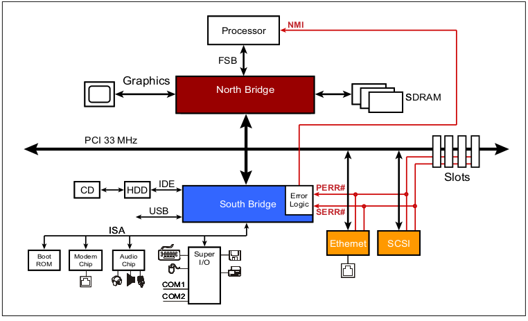
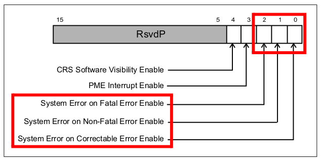

# Error Detection And Handling

this chapter discusses error types that occur in a PCIe Port or Link, how they are detected, reported and options for handling them.

first a review of the PCI approach to error handling as background information. then we focus on PCIe error handling of correctable, non-fatal and fatal errors.

## PCI background

- accomplished by retaining the PCI configuration registers that were already in place

- side-band signals: PERR#(parity error) for a potentially recoverable parity fault during data transmission. SERR#(system error) for a more serious problem that was usually not recoverable

  

- PCIe maintains legacy by using the error status bits in legacy configuration registers to record error events. that lets legacy software see PCIe error events in terms that it understands.

## PCIe error definitions
1. error detection
errors are discovered by an angent as result of a local problem
2. error logging
set appropriate bits in the architected registers based on the error detected
3. error reporting
notifying the system that an error condition exists. delivered to the root complex. the root in turn, can send an interrupt to the system when it reveives an error message.
4. error signaling
notifying another of an error condition by sending an error message, or sending a completion with a UR or CA.

## PCIe error reporting

two error reporting levels

1. Baseline capability: required for all devices for legacy error reporting. 
    - registers in the PCI-compitable space. they are visible to legacy software. 
    - register in PCIe capability register newer software can use them

2. Advanced error report capability: 
    - adds a new set of configuration registers and tracks many more details about which errors have occured.
    - how serious they are and in some case, can record information about the packet that cause the error.
    - registers in the extended PCIe space
## Error classes
- correctable errors
automatically handle by hardware
- uncorrectable errors
    - non-fatal
handled by device-specific software; link is still operational and recovery without data loss my be possible
    - fatal
handled by system software; link or device is not working properly and recovery without data loss is unlikely.
### correctable errors
- automatically corrected in hardware
- may impact performance by adding latency and consuming bandwidth
- this error aren't required to be reported to software, but doing so could allow software to track error trends and show signs of imminent failure.
### uncorrectable errors
1. can't corrected by hardware.
2. these are either non-fatal or fatal in severity
#### non-fatal uncorrectable errors
a packet failed somewhere, but the link continues to function correctly and other packets are unaffected. link is still working, recovery of the lost information may be possible, but will depend on implementation-specific software to handle it. 
example of this error type would be a completion timeout.
#### fatal uncorrectable errors
fatal errors indicate that a link or device has had an operational failure. resetting at least the failed link or device will probably be the first step, beacause it's clearly not operational for some reason.

## PCIe error checking mechanisms

### CRC

- ECRC(end-to-end CRC)

  it is generated in the transaction layer of the sender and checked in the transaction layer of the target of the packet. the ECRC is generally checked by the target device.  ECRC protect TLP in all the route. It is calculated at the originating device and is not
  removed or recalculated by intermediate devices.

- LCRC(link crc)

  it is the mandatory generated and checked in the DL layer for every TLP that goes across a link. it is intended to detect transmission errors on the link. LCRC only protect TLP in a link.

### Error checked by layer
Different aspects of an incoming packet are checked in the different layers at the Receiver.
### Physical layer errors
- When using 8b/10b, checking for decode violations (checking required)
- Framing violations (optional for 8b/10b, required for 128b/130b)
- Elastic buffer errors (checking optional)
- Loss of symbol lock or Lane deskew (checking optional)
### Data link layer errors
- LCRC failure for TLPs
- Sequence Number violation for TLPs
- 16 bit CRC failure for DLLPs
- Link Layer Protocol errors 
### Transaction layer errors
- ECRC failure (checking optional)
- Malformed TLP (error in packet format)
- Flow Control Protocol violation
- Unsupported Requests
- Data Corruption (poisoned packet)
- Completer Abort (checking optional)
- Receiver Overflow (checking optional)
- Completion Timeouts
- Unexpected Completion (Completion does not match pending Request)
## Source of PCIe errors
### Ecrc generation and checking
- enable ecrc
    1. requires AER configuration register structure
    2. ECRCs are supported
    3. a write to the Error Capability and Control register can be used to enable it.
- TLP Digest
if ECRC capability is enable, a special bit called TD is set in the header to indicate that it's present at the end of the packet.
- variant bits not include in ECRC mechanism
EP field is not include in ECRC mechanism
- ECRC in request
completer that detect an ECRC error must set the ECRC error status bit. they mey also choose not to return a completion for this request
- ECRC in completion
requesters that detect an ecrc error must set the ecrc error status bit. they may also choose to report the error to their device driver with a specific interrupt.
### Data poisoning
- provides an optional way for a device to indicate that the data associated with a TLP is corrupted. the EP bit in the packet header is set to indicate the error.
- in write Requests or Completions with data, corruption of that data could happen which needs to be reported to the target device. In each of these cases, the packet can be forwarded to the recipient but marked as having bad data by the EP bit in the header.
- The spec states that data poisoning applies only to the data payload associated with a packet (such as Memory, Configuration, or I/O writes and Completions) and never to the contents of the TLP header.
### Split transaction errors
PCIe defines a status field within the Completion header that allows the Completer to report some errors back to the Requester.
- unsupported request(UR)
If a receiver doesn’t support a Request, it returns a Completion with UR status.
- completer abort
Several circumstances can occur that could result in a Completer returning this CA status to the Requester.
- unexpected completion
- completion timeout
    1. Device Control Register 2 was added to the PCI Express Capability Block to allow software visibility and control of the timeout values.
    2. If Requests need multiple Completions to return the requested data, a single Completion won’t stop the timer. Instead, the timer continues to run until all the data has been returned regardless of how many Completions are needed. If only part of the data has been returned when the timeout occurs, the Requester may discard or keep that data.
### Link flow control related errors
### Malformed TLP
TLPs arriving in the Transaction Layer are checked for violations of the packet formatting rules.

## How errors are reported

1. Completions: completion status reports errors back to the requester.
2. Poisoned packet: reports bad data in a TLP to the receiver.
3. Error message: reports errors to the host(software).
### Error Messages
- PCIe eliminated the sideband signals from PCI and replace them with error messages
- PERR# and SERR#=======>>>error messages
- error message routed to the RC for handling.
- the message code defines the type of message
- multiple devices might report an error caused by the same event. when that happend system software might be called to investigate and might not understand.[Role-Based Error Reporting field]
- a Non Fatal condition will be handled by sending an ERR_COR.
### PCI-Compatible error reporting mechanisms
the PCI Express errors tracked by the PCI compatible registers are
1. Transaction Poisoning/Error Forwarding (synonymous to data parity error in PCI)
2. Completer Abort (CA) detected by a Completer (synonymous to Target Abort in PCI)
3. Unsupported Request (UR) detected by a Completer (synonymous to Master Abort in PCI)
### PCIe error reporting
Device Capabilities 2
Link Capabilities 2
Slot Capabilities 2
### Root's response to error message
the action it takes is determined in part by the settings in the Root Control Register.

- link error

  set Retrain link. retraining the link

  ## Advanced error reporting

  ### Handling sticky bits

  sticky bits keep error status information available through a reset. Specifically, sticky bits will survive an FLR (Function Level Reset), a Hot Reset, and a Warm Reset because power is available to keep them active. They may even survive a Cold Reset if a secondary power source like V aux is available to keep them active when the main power is shut off.

### Advanced correctable error handling

  - Advanced correctable error status

  - Advanced correctable error masking

### Advanced uncorrectable error handling
  - Advanced uncorrectable error status
  - selecting uncorrectable error severity
  - uncorrectable error masking
### Root complex error tracking and reporting
- RC is the target of all error messages from devices in aPCIe topology. Errors received by the Root update status registers and may be reportex to the host system if enable to do so.
- Root Error Status register indicates the type of error received and whether multiple errors of the same type have been received.
### Example flow of software error investigation
We are going to follow the steps of error handling software would take to determine what errors have occurred, where they occurred and what packets were they detected in.

1. software knows root port called the error handler based on th interrupt.
2. error handler reads the Root Error Status register of the AER structure on root port. to verify ERR_COR ERR_FATAL or ERR_NONFATAL
3. to determine which BDF beneath this Root Port sent the error by checking AER Source ID register of Root Port.
4. to determine which of the multiple uncorrectable errors occurred first
5. to find the TLP that catched in AER

