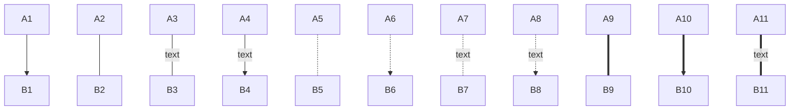
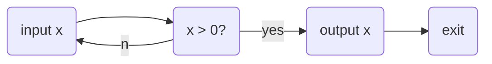
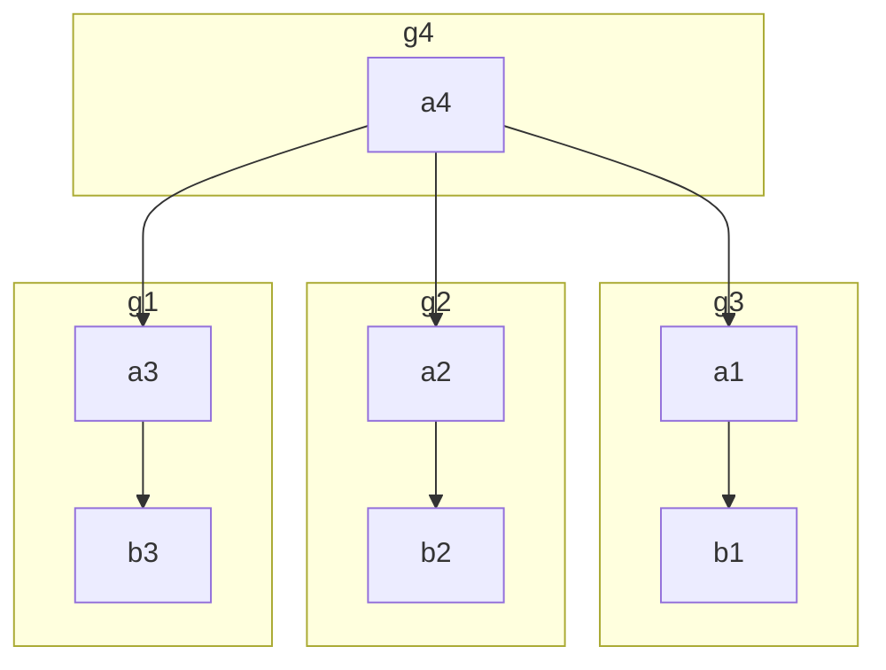

# hello world
## hello world
### hello world
hello world

**hello world** [bold]

*hello world* [italic]

~~hello world~~ [strikethrough]

>hello world
>>hello world
>>
>>>hello world


[hello world](http://hello_world.com)

---

- hello world
+ hello world
* hello world

1. hello world
   - hello world
      - hello world
      - hello world
   
2. hello world
   - hello world
   - hello world


hello|hello|hello
-|-|-
world|world|world
world|world|world


``````c
#include <stdlib.h>
#include <stdio.h>
int main(int argc, char * argv[]*)
{
  printf("hello world\n");
  return 0;
}
``````
```c
int __sys_socket(int family, int type, int protocol)
{
	int retval;
	struct socket *sock;
	int flags;

	/* Check the SOCK_* constants for consistency.  */
	BUILD_BUG_ON(SOCK_CLOEXEC != O_CLOEXEC);
	BUILD_BUG_ON((SOCK_MAX | SOCK_TYPE_MASK) != SOCK_TYPE_MASK);
	BUILD_BUG_ON(SOCK_CLOEXEC & SOCK_TYPE_MASK);
	BUILD_BUG_ON(SOCK_NONBLOCK & SOCK_TYPE_MASK);

	flags = type & ~SOCK_TYPE_MASK;
	if (flags & ~(SOCK_CLOEXEC | SOCK_NONBLOCK))
		return -EINVAL;
	type &= SOCK_TYPE_MASK;

	if (SOCK_NONBLOCK != O_NONBLOCK && (flags & SOCK_NONBLOCK))
		flags = (flags & ~SOCK_NONBLOCK) | O_NONBLOCK;

	retval = sock_create(family, type, protocol, &sock);
	if (retval < 0)
		return retval;

	return sock_map_fd(sock, flags & (O_CLOEXEC | O_NONBLOCK));
}

SYSCALL_DEFINE3(socket, int, family, int, type, int, protocol)
{
	return __sys_socket(family, type, protocol);
}


```

```flowchart
st=>start:>http://www.google.com[blank]
e=>end:>http://www.google.com
op1=>operation: My Operation
sub1=>subroutine: My Subroutine
cond=>condition: Yes
or No?:>http://www.google.com
io=>inputoutput: catch something...

st->op1->cond
cond(yes)->io->e
cond(no)->sub1(right)->op1
```

## mermaid画图
- 图方向
    TB，从上到下
    TD，从上到下
    BT，从下到上
    RL，从右到左
    LR，从左到右
    T = TOP，B = BOTTOM，L = LEFT，R = RIGHT，D = DOWN
    
- 节点图形

    ```mermaid
    graph TB
      A
      B[bname]
      C(cname)
      D((dname))
      E>ename]
      F{fname}
    ```
    
- 箭头

- 流程


- 子图，其中的变量是全局的
格式：
```
graph LR
  subgraph title1
    graph definition 
  end
  subgraph title2
    graph definition 
  end
  ...
```




## 流程图
```flowchart
st=>start: 开始
op=>operation: Your Operation
cond=>condition: Yes or No?
e=>end
d=>end
st->op->cond
cond(yes)->e
cond(no)->d
```
```flowchart
st=>start: 开始
op=>operation: oper
st->op

```
```flowchart
st=>start: start
op=>operation: op
st->op
```

```flowchart
st=>start: 开始
e=>end: 结束
op1=>operation: 操作1
op2=>operation: 操作2
op3=>operation: 操作3
pa=>parallel: 多输出操作4
cond=>condition: 确认？

st->op1->cond
cond(true)->e	
cond(no)->op2(right)->op3->pa(path1,left)->op3
pa(path2,left)->e
```


